```r
library(tidyverse)     # for graphing and data cleaning
library(gardenR)       # for Lisa's garden data
library(lubridate)     # for date manipulation
library(ggthemes)      # for even more plotting themes
library(geofacet)      # for special faceting with US map layout
theme_set(theme_minimal())       # My favorite ggplot() theme :)
```


```r
# Lisa's garden data
data("garden_harvest")

# Seeds/plants (and other garden supply) costs
data("garden_spending")

# Planting dates and locations
data("garden_planting")

# Tidy Tuesday dog breed data
breed_traits <- readr::read_csv('https://raw.githubusercontent.com/rfordatascience/tidytuesday/master/data/2022/2022-02-01/breed_traits.csv')
trait_description <- readr::read_csv('https://raw.githubusercontent.com/rfordatascience/tidytuesday/master/data/2022/2022-02-01/trait_description.csv')
breed_rank_all <- readr::read_csv('https://raw.githubusercontent.com/rfordatascience/tidytuesday/master/data/2022/2022-02-01/breed_rank.csv')

# Tidy Tuesday data for challenge problem
kids <- readr::read_csv('https://raw.githubusercontent.com/rfordatascience/tidytuesday/master/data/2020/2020-09-15/kids.csv')
```

## Setting up on GitHub!

Before starting your assignment, you need to get yourself set up on GitHub and make sure GitHub is connected to R Studio. To do that, you should read the instruction (through the "Cloning a repo" section) and watch the video [here](https://github.com/llendway/github_for_collaboration/blob/master/github_for_collaboration.md). Then, do the following (if you get stuck on a step, don't worry, I will help! You can always get started on the homework and we can figure out the GitHub piece later):

* Create a repository on GitHub, giving it a nice name so you know it is for the 3rd weekly exercise assignment (follow the instructions in the document/video).  
* Copy the repo name so you can clone it to your computer. In R Studio, go to file --> New project --> Version control --> Git and follow the instructions from the document/video.  
* Download the code from this document and save it in the repository folder/project on your computer.  
* In R Studio, you should then see the .Rmd file in the upper right corner in the Git tab (along with the .Rproj file and probably .gitignore).  
* Check all the boxes of the files in the Git tab and choose commit.  
* In the commit window, write a commit message, something like "Initial upload" would be appropriate, and commit the files.  
* Either click the green up arrow in the commit window or close the commit window and click the green up arrow in the Git tab to push your changes to GitHub.  
* Refresh your GitHub page (online) and make sure the new documents have been pushed out.  
* Back in R Studio, knit the .Rmd file. When you do that, you should have two (as long as you didn't make any changes to the .Rmd file, in which case you might have three) files show up in the Git tab - an .html file and an .md file. The .md file is something we haven't seen before and is here because I included `keep_md: TRUE` in the YAML heading. The .md file is a markdown (NOT R Markdown) file that is an interim step to creating the html file. They are displayed fairly nicely in GitHub, so we want to keep it and look at it there. Click the boxes next to these two files, commit changes (remember to include a commit message), and push them (green up arrow).  
* As you work through your homework, save and commit often, push changes occasionally (maybe after you feel finished with an exercise?), and go check to see what the .md file looks like on GitHub.  
* If you have issues, let me know! This is new to many of you and may not be intuitive at first. But, I promise, you'll get the hang of it! 


## Instructions

* Put your name at the top of the document. 

* **For ALL graphs, you should include appropriate labels.** 

* Feel free to change the default theme, which I currently have set to `theme_minimal()`. 

* Use good coding practice. Read the short sections on good code with [pipes](https://style.tidyverse.org/pipes.html) and [ggplot2](https://style.tidyverse.org/ggplot2.html). **This is part of your grade!**

* When you are finished with ALL the exercises, uncomment the options at the top so your document looks nicer. Don't do it before then, or else you might miss some important warnings and messages.


## Warm-up exercises with garden data

These exercises will reiterate what you learned in the "Expanding the data wrangling toolkit" tutorial. If you haven't gone through the tutorial yet, you should do that first.

  1. Summarize the `garden_harvest` data to find the total harvest weight in pounds for each vegetable and day of week (HINT: use the `wday()` function from `lubridate`). Display the results so that the vegetables are rows but the days of the week are columns.


```r
garden_harvest %>% 
  mutate(wkday = wday(date, label = TRUE, abbr = TRUE)) %>% 
  group_by(vegetable, wkday) %>% 
  summarise(g_per_wday = sum(weight)) %>% 
  mutate( lbs_per_wday = g_per_wday * 0.00220462) %>%
  ungroup() %>% 
  arrange(wkday) %>% 
  pivot_wider(id_cols = "vegetable",
               names_from = "wkday",
               values_from ="lbs_per_wday") 
```

<div data-pagedtable="false">
  <script data-pagedtable-source type="application/json">
{"columns":[{"label":["vegetable"],"name":[1],"type":["chr"],"align":["left"]},{"label":["Sun"],"name":[2],"type":["dbl"],"align":["right"]},{"label":["Mon"],"name":[3],"type":["dbl"],"align":["right"]},{"label":["Tue"],"name":[4],"type":["dbl"],"align":["right"]},{"label":["Wed"],"name":[5],"type":["dbl"],"align":["right"]},{"label":["Thu"],"name":[6],"type":["dbl"],"align":["right"]},{"label":["Fri"],"name":[7],"type":["dbl"],"align":["right"]},{"label":["Sat"],"name":[8],"type":["dbl"],"align":["right"]}],"data":[{"1":"beans","2":"1.91361016","3":"6.5080382","4":"4.38719380","5":"4.08295624","6":"3.39291018","7":"1.52559704","8":"4.70906832"},{"1":"beets","2":"0.32187452","3":"0.6724091","4":"0.15873264","5":"0.18298346","6":"11.89172028","7":"0.02425082","8":"0.37919464"},{"1":"broccoli","2":"1.25883802","3":"0.8201186","4":"NA","5":"0.70768302","6":"NA","7":"0.16534650","8":"NA"},{"1":"carrots","2":"2.93655384","3":"0.8708249","4":"0.35273920","5":"5.56225626","6":"2.67420406","7":"2.13848140","8":"2.33028334"},{"1":"corn","2":"1.45725382","3":"0.7583893","4":"0.72752460","5":"5.30211110","6":"NA","7":"3.44802568","8":"1.31615814"},{"1":"cucumbers","2":"3.10410496","3":"4.7752069","4":"10.04645334","5":"5.30652034","6":"3.30693000","7":"7.42956940","8":"9.64080326"},{"1":"jalapeño","2":"0.26234978","3":"5.5534378","4":"0.54895038","5":"0.48060716","6":"0.22487124","7":"1.29411194","8":"1.50796008"},{"1":"kale","2":"0.82673250","3":"2.0679336","4":"0.28219136","5":"0.61729360","6":"0.27998674","7":"0.38139926","8":"1.49032312"},{"1":"lettuce","2":"1.46607230","3":"2.4581513","4":"0.91712192","5":"1.18608556","6":"2.45153744","7":"1.80117454","8":"1.31615814"},{"1":"onions","2":"0.26014516","3":"0.5092672","4":"0.70768302","5":"NA","6":"0.60186126","7":"0.07275246","8":"1.91361016"},{"1":"peas","2":"2.05691046","3":"4.6341112","4":"2.06793356","5":"1.08026380","6":"3.39731942","7":"0.93696350","8":"2.85277828"},{"1":"peppers","2":"0.50265336","3":"2.5264945","4":"1.44402610","5":"2.44271896","6":"0.70988764","7":"0.33510224","8":"1.38229674"},{"1":"radish","2":"0.08157094","3":"0.1962112","4":"0.09479866","5":"NA","6":"0.14770954","7":"0.19400656","8":"0.23148510"},{"1":"rutabaga","2":"19.26396956","3":"NA","4":"NA","5":"NA","6":"NA","7":"3.57809826","8":"6.89825598"},{"1":"spinach","2":"0.48722102","3":"0.1477095","4":"0.49603950","5":"0.21384814","6":"0.23368972","7":"0.19621118","8":"0.26014516"},{"1":"strawberries","2":"0.08157094","3":"0.4784025","4":"NA","5":"NA","6":"0.08818480","7":"0.48722102","8":"0.16975574"},{"1":"Swiss chard","2":"1.24781492","3":"1.0736499","4":"0.07054784","5":"0.90830344","6":"2.23107544","7":"0.61729360","8":"0.73413846"},{"1":"tomatoes","2":"75.60964752","3":"11.4926841","4":"48.75076206","5":"58.26590198","6":"34.51773534","7":"85.07628580","8":"35.12621046"},{"1":"zucchini","2":"12.23564100","3":"12.1959578","4":"16.46851140","5":"2.04147812","6":"34.63017096","7":"18.72163304","8":"3.41495638"},{"1":"basil","2":"NA","3":"0.0661386","4":"0.11023100","5":"NA","6":"0.02645544","7":"0.46737944","8":"0.41005932"},{"1":"hot peppers","2":"NA","3":"1.2588380","4":"0.14109568","5":"0.06834322","6":"NA","7":"NA","8":"NA"},{"1":"potatoes","2":"NA","3":"0.9700328","4":"NA","5":"4.57017726","6":"11.85203712","7":"3.74124014","8":"2.80207202"},{"1":"pumpkins","2":"NA","3":"30.1195184","4":"31.85675900","5":"NA","6":"NA","7":"NA","8":"92.68883866"},{"1":"raspberries","2":"NA","3":"0.1300726","4":"0.33510224","5":"NA","6":"0.28880522","7":"0.57099658","8":"0.53351804"},{"1":"squash","2":"NA","3":"24.3345956","4":"18.46810174","5":"NA","6":"NA","7":"NA","8":"56.22221924"},{"1":"cilantro","2":"NA","3":"NA","4":"0.00440924","5":"NA","6":"NA","7":"0.07275246","8":"0.03747854"},{"1":"edamame","2":"NA","3":"NA","4":"1.40213832","5":"NA","6":"NA","7":"NA","8":"4.68922674"},{"1":"chives","2":"NA","3":"NA","4":"NA","5":"0.01763696","6":"NA","7":"NA","8":"NA"},{"1":"kohlrabi","2":"NA","3":"NA","4":"NA","5":"NA","6":"0.42108242","7":"NA","8":"NA"},{"1":"apple","2":"NA","3":"NA","4":"NA","5":"NA","6":"NA","7":"NA","8":"0.34392072"},{"1":"asparagus","2":"NA","3":"NA","4":"NA","5":"NA","6":"NA","7":"NA","8":"0.04409240"}],"options":{"columns":{"min":{},"max":[10]},"rows":{"min":[10],"max":[10]},"pages":{}}}
  </script>
</div>

  2. Summarize the `garden_harvest` data to find the total harvest in pounds for each vegetable variety and then try adding the plot from the `garden_planting` table. This will not turn out perfectly. What is the problem? How might you fix it?


```r
garden_harvest %>% 
  group_by(vegetable, variety) %>% 
  summarise(g = sum(weight)) %>% 
  mutate( lbs = g * 0.00220462) %>%  
  select(-"g") %>% 
  full_join(garden_planting %>% select(c('vegetable', 'variety', 'plot')), 
            by = c('vegetable', 'variety')) 
```

<div data-pagedtable="false">
  <script data-pagedtable-source type="application/json">
{"columns":[{"label":["vegetable"],"name":[1],"type":["chr"],"align":["left"]},{"label":["variety"],"name":[2],"type":["chr"],"align":["left"]},{"label":["lbs"],"name":[3],"type":["dbl"],"align":["right"]},{"label":["plot"],"name":[4],"type":["chr"],"align":["left"]}],"data":[{"1":"apple","2":"unknown","3":"0.34392072","4":"NA"},{"1":"asparagus","2":"asparagus","3":"0.04409240","4":"NA"},{"1":"basil","2":"Isle of Naxos","3":"1.08026380","4":"potB"},{"1":"beans","2":"Bush Bush Slender","3":"22.12997556","4":"M"},{"1":"beans","2":"Bush Bush Slender","3":"22.12997556","4":"D"},{"1":"beans","2":"Chinese Red Noodle","3":"0.78484472","4":"K"},{"1":"beans","2":"Chinese Red Noodle","3":"0.78484472","4":"L"},{"1":"beans","2":"Classic Slenderette","3":"3.60455370","4":"E"},{"1":"beets","2":"Gourmet Golden","3":"7.02171470","4":"H"},{"1":"beets","2":"leaves","3":"0.22266662","4":"NA"},{"1":"beets","2":"Sweet Merlin","3":"6.38678414","4":"H"},{"1":"broccoli","2":"Main Crop Bravado","3":"2.13186754","4":"D"},{"1":"broccoli","2":"Main Crop Bravado","3":"2.13186754","4":"I"},{"1":"broccoli","2":"Yod Fah","3":"0.82011864","4":"P"},{"1":"carrots","2":"Bolero","3":"8.29157582","4":"H"},{"1":"carrots","2":"Bolero","3":"8.29157582","4":"L"},{"1":"carrots","2":"Dragon","3":"4.10500244","4":"H"},{"1":"carrots","2":"Dragon","3":"4.10500244","4":"L"},{"1":"carrots","2":"greens","3":"0.37258078","4":"NA"},{"1":"carrots","2":"King Midas","3":"4.09618396","4":"H"},{"1":"carrots","2":"King Midas","3":"4.09618396","4":"L"},{"1":"chives","2":"perrenial","3":"0.01763696","4":"NA"},{"1":"cilantro","2":"cilantro","3":"0.11464024","4":"potD"},{"1":"cilantro","2":"cilantro","3":"0.11464024","4":"E"},{"1":"corn","2":"Dorinny Sweet","3":"11.40670388","4":"A"},{"1":"corn","2":"Golden Bantam","3":"1.60275874","4":"B"},{"1":"cucumbers","2":"pickling","3":"43.60958822","4":"L"},{"1":"edamame","2":"edamame","3":"6.09136506","4":"O"},{"1":"hot peppers","2":"thai","3":"0.14770954","4":"potB"},{"1":"hot peppers","2":"variety","3":"1.32056738","4":"potC"},{"1":"jalapeño","2":"giant","3":"9.87228836","4":"L"},{"1":"kale","2":"Heirloom Lacinto","3":"5.94586014","4":"P"},{"1":"kale","2":"Heirloom Lacinto","3":"5.94586014","4":"front"},{"1":"kohlrabi","2":"Crispy Colors Duo","3":"0.42108242","4":"front"},{"1":"lettuce","2":"Farmer's Market Blend","3":"3.80296950","4":"C"},{"1":"lettuce","2":"Farmer's Market Blend","3":"3.80296950","4":"L"},{"1":"lettuce","2":"Lettuce Mixture","3":"4.74875148","4":"G"},{"1":"lettuce","2":"mustard greens","3":"0.05070626","4":"NA"},{"1":"lettuce","2":"reseed","3":"0.09920790","4":"NA"},{"1":"lettuce","2":"Tatsoi","3":"2.89466606","4":"P"},{"1":"onions","2":"Delicious Duo","3":"0.75398004","4":"P"},{"1":"onions","2":"Long Keeping Rainbow","3":"3.31133924","4":"H"},{"1":"peas","2":"Magnolia Blossom","3":"7.45822946","4":"B"},{"1":"peas","2":"Super Sugar Snap","3":"9.56805080","4":"A"},{"1":"peppers","2":"green","3":"5.69232884","4":"K"},{"1":"peppers","2":"green","3":"5.69232884","4":"O"},{"1":"peppers","2":"variety","3":"3.65085072","4":"potA"},{"1":"peppers","2":"variety","3":"3.65085072","4":"potA"},{"1":"peppers","2":"variety","3":"3.65085072","4":"potD"},{"1":"potatoes","2":"purple","3":"3.00930630","4":"D"},{"1":"potatoes","2":"red","3":"4.43349082","4":"I"},{"1":"potatoes","2":"Russet","3":"9.09185288","4":"D"},{"1":"potatoes","2":"yellow","3":"7.40090934","4":"I"},{"1":"potatoes","2":"yellow","3":"7.40090934","4":"I"},{"1":"pumpkins","2":"Cinderella's Carraige","3":"32.87308882","4":"B"},{"1":"pumpkins","2":"New England Sugar","3":"44.85960776","4":"K"},{"1":"pumpkins","2":"saved","3":"76.93241952","4":"B"},{"1":"radish","2":"Garden Party Mix","3":"0.94578198","4":"C"},{"1":"radish","2":"Garden Party Mix","3":"0.94578198","4":"G"},{"1":"radish","2":"Garden Party Mix","3":"0.94578198","4":"H"},{"1":"raspberries","2":"perrenial","3":"1.85849466","4":"NA"},{"1":"rutabaga","2":"Improved Helenor","3":"29.74032380","4":"NA"},{"1":"spinach","2":"Catalina","3":"2.03486426","4":"H"},{"1":"spinach","2":"Catalina","3":"2.03486426","4":"E"},{"1":"squash","2":"Blue (saved)","3":"41.52401770","4":"A"},{"1":"squash","2":"Blue (saved)","3":"41.52401770","4":"B"},{"1":"squash","2":"delicata","3":"10.49840044","4":"K"},{"1":"squash","2":"Red Kuri","3":"22.73183682","4":"A"},{"1":"squash","2":"Red Kuri","3":"22.73183682","4":"B"},{"1":"squash","2":"Red Kuri","3":"22.73183682","4":"side"},{"1":"squash","2":"Waltham Butternut","3":"24.27066158","4":"A"},{"1":"squash","2":"Waltham Butternut","3":"24.27066158","4":"K"},{"1":"strawberries","2":"perrenial","3":"1.30513504","4":"NA"},{"1":"Swiss chard","2":"Neon Glow","3":"6.88282364","4":"M"},{"1":"tomatoes","2":"Amish Paste","3":"65.67342518","4":"J"},{"1":"tomatoes","2":"Amish Paste","3":"65.67342518","4":"N"},{"1":"tomatoes","2":"Better Boy","3":"34.00846812","4":"J"},{"1":"tomatoes","2":"Better Boy","3":"34.00846812","4":"N"},{"1":"tomatoes","2":"Big Beef","3":"24.99377694","4":"N"},{"1":"tomatoes","2":"Black Krim","3":"15.80712540","4":"N"},{"1":"tomatoes","2":"Bonny Best","3":"24.92322910","4":"J"},{"1":"tomatoes","2":"Brandywine","3":"15.64618814","4":"J"},{"1":"tomatoes","2":"Cherokee Purple","3":"15.71232674","4":"J"},{"1":"tomatoes","2":"grape","3":"32.39468628","4":"O"},{"1":"tomatoes","2":"Jet Star","3":"15.02448530","4":"N"},{"1":"tomatoes","2":"Mortgage Lifter","3":"26.32536742","4":"J"},{"1":"tomatoes","2":"Mortgage Lifter","3":"26.32536742","4":"N"},{"1":"tomatoes","2":"Old German","3":"26.71778978","4":"J"},{"1":"tomatoes","2":"volunteers","3":"51.61235882","4":"N"},{"1":"tomatoes","2":"volunteers","3":"51.61235882","4":"J"},{"1":"tomatoes","2":"volunteers","3":"51.61235882","4":"front"},{"1":"tomatoes","2":"volunteers","3":"51.61235882","4":"O"},{"1":"zucchini","2":"Romanesco","3":"99.70834874","4":"D"},{"1":"squash","2":"Butternut (saved)","3":"NA","4":"A"},{"1":"pumpkins","2":"Cinderalla's Carraige","3":"NA","4":"A"},{"1":"dill","2":"Grandma Einck's","3":"NA","4":"wagon"},{"1":"brussels sprouts","2":"Long Island","3":"NA","4":"D"},{"1":"pumpkins","2":"Big Max","3":"NA","4":"side"},{"1":"pumpkins","2":"Cinderalla's Carraige","3":"NA","4":"side"},{"1":"watermelon","2":"Doll Babies","3":"NA","4":"side"},{"1":"melon","2":"honeydew","3":"NA","4":"side"},{"1":"rudabaga","2":"Improved Helenor","3":"NA","4":"E"},{"1":"strawberries","2":"perennial","3":"NA","4":"F"}],"options":{"columns":{"min":{},"max":[10]},"rows":{"min":[10],"max":[10]},"pages":{}}}
  </script>
</div>

  3. I would like to understand how much money I "saved" by gardening, for each vegetable type. Describe how I could use the `garden_harvest` and `garden_spending` datasets, along with data from somewhere like [this](https://products.wholefoodsmarket.com/search?sort=relevance&store=10542) to answer this question. You can answer this in words, referencing various join functions. You don't need R code but could provide some if it's helpful.
  
  In order to understand how much money you saved, you first need to know how much you spent to get a certain number of pounds of a vegetable and variety. You could do this by first calculating each harvest in terms of pounds. Then we can find the total harvest in lbs for each vegetable variety. Next you could left join `garden_harvest` to `garden_spending` so that for each vegetable and variety, we can see the total lbs harvested and the price paid (also with tax) for that amount of harvest. After joining, you can sum the price with tax and lbs harvested for each vegetable. Using the Whole Foods website to price what the amount of vegetable lbs would have been, you can calculate the total price by multiplying the total number of lbs harvested by the price / lbs. Then subtract off the summed price with tax for each of the vegetables to find how much money was saved per vegetables. 

  4. Subset the data to tomatoes. Reorder the tomato varieties from smallest to largest first harvest date. Create a barplot of total harvest in pounds for each variety, in the new order.CHALLENGE: add the date near the end of the bar. (This is probably not a super useful graph because it's difficult to read. This is more an exercise in using some of the functions you just learned.)


```r
garden_harvest %>% 
  filter(vegetable == 'tomatoes') %>% 
  group_by(variety) %>% 
  summarise(total_g = sum(weight),
            first_day = min(date)) %>% 
  mutate( total_lbs = total_g * 0.00220462) %>% 
  ggplot(aes(y = fct_rev(fct_reorder(str_to_title(variety), first_day)), x = total_lbs)) +
  geom_bar(stat='identity') +
  labs(title = "Tomato Variety Total Pounds by First Harvest Date", x = "Lbs", y = "") +
  geom_col(fill = "pink") +
  geom_text(aes(label = first_day, hjust = 1.25, nudge_x = -.5), size = 3)
```

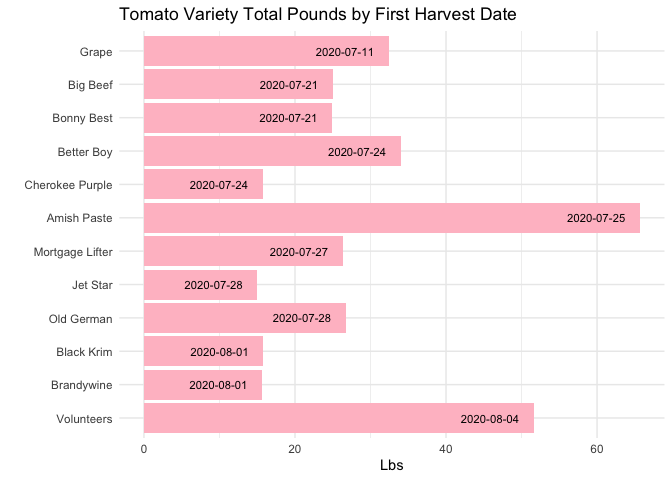<!-- -->

  5. In the `garden_harvest` data, create two new variables: one that makes the varieties lowercase and another that finds the length of the variety name. Arrange the data by vegetable and length of variety name (smallest to largest), with one row for each vegetable variety. HINT: use `str_to_lower()`, `str_length()`, and `distinct()`.
  

```r
garden_harvest %>% 
  mutate(lower_variety = str_to_lower(variety),
         variety_length = str_length(lower_variety)) %>% 
  distinct(lower_variety, variety_length)  %>% 
  arrange(variety_length)
```

<div data-pagedtable="false">
  <script data-pagedtable-source type="application/json">
{"columns":[{"label":["lower_variety"],"name":[1],"type":["chr"],"align":["left"]},{"label":["variety_length"],"name":[2],"type":["int"],"align":["right"]}],"data":[{"1":"red","2":"3"},{"1":"thai","2":"4"},{"1":"grape","2":"5"},{"1":"giant","2":"5"},{"1":"green","2":"5"},{"1":"saved","2":"5"},{"1":"reseed","2":"6"},{"1":"leaves","2":"6"},{"1":"tatsoi","2":"6"},{"1":"dragon","2":"6"},{"1":"bolero","2":"6"},{"1":"purple","2":"6"},{"1":"yellow","2":"6"},{"1":"greens","2":"6"},{"1":"russet","2":"6"},{"1":"variety","2":"7"},{"1":"yod fah","2":"7"},{"1":"edamame","2":"7"},{"1":"unknown","2":"7"},{"1":"catalina","2":"8"},{"1":"cilantro","2":"8"},{"1":"pickling","2":"8"},{"1":"big beef","2":"8"},{"1":"jet star","2":"8"},{"1":"delicata","2":"8"},{"1":"red kuri","2":"8"},{"1":"perrenial","2":"9"},{"1":"asparagus","2":"9"},{"1":"neon glow","2":"9"},{"1":"romanesco","2":"9"},{"1":"bonny best","2":"10"},{"1":"king midas","2":"10"},{"1":"better boy","2":"10"},{"1":"old german","2":"10"},{"1":"brandywine","2":"10"},{"1":"black krim","2":"10"},{"1":"volunteers","2":"10"},{"1":"amish paste","2":"11"},{"1":"sweet merlin","2":"12"},{"1":"blue (saved)","2":"12"},{"1":"isle of naxos","2":"13"},{"1":"delicious duo","2":"13"},{"1":"dorinny sweet","2":"13"},{"1":"golden bantam","2":"13"},{"1":"mustard greens","2":"14"},{"1":"gourmet golden","2":"14"},{"1":"lettuce mixture","2":"15"},{"1":"cherokee purple","2":"15"},{"1":"mortgage lifter","2":"15"},{"1":"garden party mix","2":"16"},{"1":"heirloom lacinto","2":"16"},{"1":"magnolia blossom","2":"16"},{"1":"super sugar snap","2":"16"},{"1":"improved helenor","2":"16"},{"1":"bush bush slender","2":"17"},{"1":"main crop bravado","2":"17"},{"1":"crispy colors duo","2":"17"},{"1":"waltham butternut","2":"17"},{"1":"new england sugar","2":"17"},{"1":"chinese red noodle","2":"18"},{"1":"classic slenderette","2":"19"},{"1":"long keeping rainbow","2":"20"},{"1":"farmer's market blend","2":"21"},{"1":"cinderella's carraige","2":"21"}],"options":{"columns":{"min":{},"max":[10]},"rows":{"min":[10],"max":[10]},"pages":{}}}
  </script>
</div>

  6. In the `garden_harvest` data, find all distinct vegetable varieties that have "er" or "ar" in their name. HINT: `str_detect()` with an "or" statement (use the | for "or") and `distinct()`.


```r
garden_harvest %>% 
 filter(str_detect(variety, "er") | str_detect(variety, "ar") ) %>% 
  distinct(variety, vegetable)
```

<div data-pagedtable="false">
  <script data-pagedtable-source type="application/json">
{"columns":[{"label":["vegetable"],"name":[1],"type":["chr"],"align":["left"]},{"label":["variety"],"name":[2],"type":["chr"],"align":["left"]}],"data":[{"1":"radish","2":"Garden Party Mix"},{"1":"lettuce","2":"Farmer's Market Blend"},{"1":"peas","2":"Super Sugar Snap"},{"1":"chives","2":"perrenial"},{"1":"strawberries","2":"perrenial"},{"1":"asparagus","2":"asparagus"},{"1":"lettuce","2":"mustard greens"},{"1":"raspberries","2":"perrenial"},{"1":"beans","2":"Bush Bush Slender"},{"1":"beets","2":"Sweet Merlin"},{"1":"hot peppers","2":"variety"},{"1":"tomatoes","2":"Cherokee Purple"},{"1":"tomatoes","2":"Better Boy"},{"1":"peppers","2":"variety"},{"1":"tomatoes","2":"Mortgage Lifter"},{"1":"tomatoes","2":"Old German"},{"1":"tomatoes","2":"Jet Star"},{"1":"carrots","2":"Bolero"},{"1":"tomatoes","2":"volunteers"},{"1":"beans","2":"Classic Slenderette"},{"1":"pumpkins","2":"Cinderella's Carraige"},{"1":"squash","2":"Waltham Butternut"},{"1":"pumpkins","2":"New England Sugar"}],"options":{"columns":{"min":{},"max":[10]},"rows":{"min":[10],"max":[10]},"pages":{}}}
  </script>
</div>


## Bicycle-Use Patterns

In this activity, you'll examine some factors that may influence the use of bicycles in a bike-renting program.  The data come from Washington, DC and cover the last quarter of 2014.

<center>

{width="30%"}


{width="30%"}

</center>

Two data tables are available:

- `Trips` contains records of individual rentals
- `Stations` gives the locations of the bike rental stations

Here is the code to read in the data. We do this a little differently than usual, which is why it is included here rather than at the top of this file. To avoid repeatedly re-reading the files, start the data import chunk with `{r cache = TRUE}` rather than the usual `{r}`.


```r
data_site <- 
  "https://www.macalester.edu/~dshuman1/data/112/2014-Q4-Trips-History-Data.rds" 
Trips <- readRDS(gzcon(url(data_site)))
Stations<-read_csv("http://www.macalester.edu/~dshuman1/data/112/DC-Stations.csv")
```

**NOTE:** The `Trips` data table is a random subset of 10,000 trips from the full quarterly data. Start with this small data table to develop your analysis commands. **When you have this working well, you should access the full data set of more than 600,000 events by removing `-Small` from the name of the `data_site`.**

### Temporal patterns

It's natural to expect that bikes are rented more at some times of day, some days of the week, some months of the year than others. The variable `sdate` gives the time (including the date) that the rental started. Make the following plots and interpret them:

  7. A density plot, which is a smoothed out histogram, of the events versus `sdate`. Use `geom_density()`.
  

```r
Trips %>% 
  ggplot(aes(x = sdate)) +
  geom_density(fill = "maroon4") +
  labs(title = "Density of Bike Rental Events Over Time", x = "", y ="") +
  theme(axis.text.y = element_blank())
```

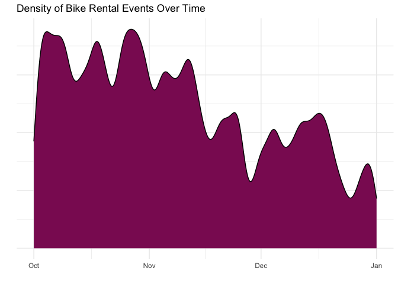<!-- -->
  
Interpret: Between October and January, we see the frequency of bike rentals decrease. This makes sense because the weather gets colder and colder so we would expect to see less people renting bikes in the winter. 


  8. A density plot of the events versus time of day.  You can use `mutate()` with `lubridate`'s  `hour()` and `minute()` functions to extract the hour of the day and minute within the hour from `sdate`. Hint: A minute is 1/60 of an hour, so create a variable where 3:30 is 3.5 and 3:45 is 3.75.
  

```r
Trips %>% 
  mutate(time_dec = hour(sdate) + minute(sdate) / 60) %>% 
  ggplot(aes(x = time_dec)) +
  geom_density(fill = "maroon3") +
  labs(title = "Number of Bike Rental Events per Time of Day", x = "", y ="") +
  theme(axis.text.y = element_blank())
```

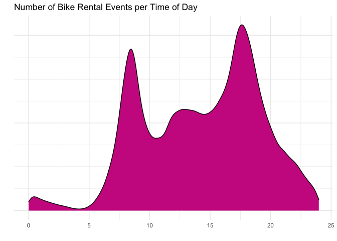<!-- -->
  
Interpret: Across the hours of the day, we see the frequency of bike rentals increase in the morning as people wake up and start going to work. There is a peak in use at around 9 am when that is rush our of going to work. There is a dip after than as people settle into their days. There is another increase in frequency around lunch time as people rent bikes to go get lunch, and finally a last peak around 5/6 pm when people go home from work! There is a little increase around 1 am and this could be because of people riding home from a night out. 
  
  9. A bar graph of the events versus day of the week. Put day on the y-axis.
  

```r
Trips %>% 
  mutate(DoW = wday(sdate, label = TRUE, abbr = TRUE)) %>% 
  ggplot(aes(y = fct_rev(DoW))) +
  geom_bar(fill = "maroon2", col = "maroon") +
  labs(title = "Number of Bike Rental Events per Day of Week", x = "", y ="")
```

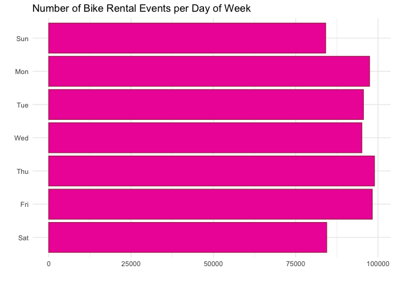<!-- -->
  
Interpret: We see here that the largest number of rental events occur during the weekdays. This suggests to me that most people use the bike rental service to commute to their jobs. The rentals are also used on the weekends though for errands and fun things!


  10. Facet your graph from exercise 8. by day of the week. Is there a pattern?
  

```r
Trips %>% 
  mutate(time_dec = hour(sdate) + minute(sdate) / 60,
         DoW = wday(sdate, label = TRUE, abbr = TRUE)) %>% 
  ggplot(aes(x = time_dec)) +
  geom_density(fill = "pink") +
  labs(title = "Density of Bike Rental Events per Time of Day", x = "", y ="") +
  facet_wrap(~ DoW) +
  theme(axis.text.y = element_blank())
```

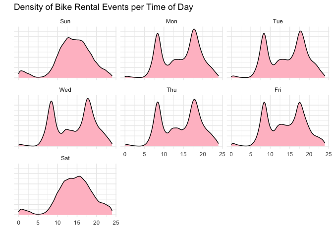<!-- -->

Interpret: From these graphs, we see a similar trend in rental frequency between the last few graphs. On weekdays, there is a consistent trend in peak rentals in the mornings and evenings when people are commuting to and from work, in addition to a slight bump over lunch time when people get food. On weekends, there a general peak slope through the entire day as people are out and about doing fun things at all times of the day. We also see smaller bumps around 1 am over the weekends when people are out late more often.


The variable `client` describes whether the renter is a regular user (level `Registered`) or has not joined the bike-rental organization (`Causal`). The next set of exercises investigate whether these two different categories of users show different rental behavior and how `client` interacts with the patterns you found in the previous exercises. 

  11. Change the graph from exercise 10 to set the `fill` aesthetic for `geom_density()` to the `client` variable. You should also set `alpha = .5` for transparency and `color=NA` to suppress the outline of the density function.
  

```r
Trips %>% 
  mutate(time_dec = hour(sdate) + minute(sdate) / 60,
         DoW = wday(sdate, label = TRUE, abbr = TRUE)) %>% 
  ggplot(aes(x = time_dec)) +
  geom_density(aes(fill = client), color = NA, alpha = 0.5) +
  labs(title = "Density of Bike Rental Events per Time of Day by Day of Week", x = "", y ="", fill = "Client") +
  facet_wrap(~ DoW) +
  theme(axis.text.y = element_blank())
```

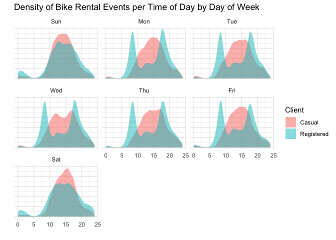<!-- -->

Interpret: By specifying the type of client, we learn more about how different riders use the bike service. It appears that the Registered clients are the one that rent bikes during the week to commute to work as their peaks are at 9 and 5 ish. The casual rider distribution actually doesn't appear to vary much across the days of the week. The rentals are a slow increase over the afternoons of all days. 

  12. Change the previous graph by adding the argument `position = position_stack()` to `geom_density()`. In your opinion, is this better or worse in terms of telling a story? What are the advantages/disadvantages of each?
  

```r
Trips %>% 
  mutate(time_dec = hour(sdate) + minute(sdate) / 60,
         DoW = wday(sdate, label = TRUE, abbr = TRUE)) %>% 
  ggplot(aes(x = time_dec)) +
  geom_density(aes(fill = client), color = NA, alpha = 0.5, position = position_stack()) +
  labs(title = "Density of Bike Rental Events per Time of Day and Day of Week", x = "", y ="", fill = "Client") +
  facet_wrap(~ DoW) +
  theme(axis.text.y = element_blank())
```

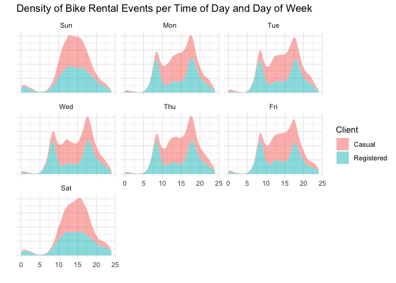<!-- -->
  
Interpret: This is worse for storytelling because the stack function adds the Casual distribution to be shown on top of the Registered distribution rather than starting the values at zero again. This prevents us from seeing the true trend over time of the Causal riders because we see residual trends left over from the registered clients. This stack could be good for see the cumulative trend for all clients as the last layer. The Casual rider outline shows the same trend when we don't facet at all for client. So what we actually see is the amount the total trend that the Registered riders make up.  

  13. In this graph, go back to using the regular density plot (without `position = position_stack()`). Add a new variable to the dataset called `weekend` which will be "weekend" if the day is Saturday or Sunday and  "weekday" otherwise (HINT: use the `ifelse()` function and the `wday()` function from `lubridate`). Then, update the graph from the previous problem by faceting on the new `weekend` variable. 
  

```r
Trips %>% 
  mutate(time_dec = hour(sdate) + minute(sdate) / 60,
         DoW = wday(sdate, label = TRUE, abbr = TRUE),
         weekend = ifelse(DoW == c("Sat", "Sun"), 'weekend', 'weekday')) %>% 
  ggplot(aes(x = time_dec)) +
  geom_density(aes(fill = client), color = NA, alpha = 0.5) +
  labs(title = "Density of Bike Rental Events per Time of Day", x = "", y ="", fill = "Client") +
  facet_wrap(~ weekend) +
  theme(axis.text.y = element_blank())
```

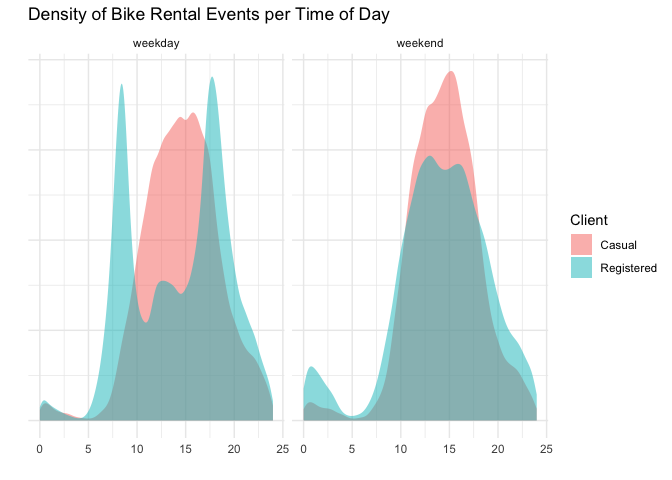<!-- -->
  
Interpret:  Looking at weekdays, we see that casual riders rent bikes more in the afternoons while the Registered riders rent bikes more round 8 am and 7 pm at higher intensities. On the weekend both Casual and Registered riders rent bikes most in the afternoon between 12 and 4 with Causal riders renting the most. We do see that Registered riders rent bikes around 1 am more than Casual riders. 


  14. Change the graph from the previous problem to facet on `client` and fill with `weekday`. What information does this graph tell you that the previous didn't? Is one graph better than the other?
  

```r
Trips %>% 
  mutate(time_dec = hour(sdate) + minute(sdate) / 60,
         DoW = wday(sdate, label = TRUE, abbr = TRUE),
         weekend = ifelse(DoW == c("Sat", "Sun"), 'weekend', 'weekday')) %>% 
  ggplot(aes(x = time_dec)) +
  geom_density(aes(fill = weekend), color = NA, alpha = 0.5) +
  labs(title = "Number of Bike Rental Events per Time of Day", x = "", y ="", fill = "Weekend") +
  facet_wrap(~ client) +
  theme(axis.text.y = element_blank())
```

<!-- -->
Interpret: The trends differ between weekdays and weekends more for Registered riders than Casual riders. It also appears that Casual riders use bikes slightly more on weekends than weekdays with a sharper peak around 3pm. We can also see how Registered riders change their habits between weekdays and weekends when they like to rent their bikes.  

### Spatial patterns

  15. Use the latitude and longitude variables in `Stations` to make a visualization of the total number of departures from each station in the `Trips` data. Use either color or size to show the variation in number of departures. We will improve this plot next week when we learn about maps!
  

```r
Trips %>% 
  group_by(sstation) %>% 
  count() %>% 
  left_join(Stations, by = c("sstation" = "name")) %>% 
  ggplot(aes(x = long, y = lat)) +
  geom_point(aes(col = n), alpha = 0.75) +
  scale_color_continuous(low = "pink", high = "maroon4") +
  labs(title = "Total Number of Bike Departures in Space", col = "Departures", x = "Longitude", y = "Latitude")
```

<!-- -->

Interpret: The highest number of rentals appear to occur in the city or in the most concentrated part of the rental space. All the points are clustered together and it appears that people mostly use the service to get around the within the cities.

  16. Only 14.4% of the trips in our data are carried out by casual users. Create a plot that shows which area(s) have stations with a much higher percentage of departures by casual users. What patterns do you notice? (Again, we'll improve this next week when we learn about maps).
  

```r
Trips %>% 
  group_by(sstation) %>% 
  summarise(prop_casual =  sum(client == 'Casual') / n()) %>% 
  left_join(Stations, by = c("sstation" = "name")) %>% 
  ggplot(aes(x = long, y = lat)) +
  geom_point(aes(col = prop_casual), alpha = 0.75) +
  scale_color_continuous(low = "pink", high = "maroon4") +
  labs(title = "Proportion of Bike Departures by Clients in Space", col = "Departures", x = "Longitude", y = "Latitude")
```

<!-- -->
  
Interpret: The largest proportion of Casual riders appear to com from outside of the cities or appear to leave the cities and come back. This helps me to conclude that casual riders go between the city and suburbs occasionally whhile the registered riders rely on the bike service to commute around the city more consistently.  
  
  
**DID YOU REMEMBER TO GO BACK AND CHANGE THIS SET OF EXERCISES TO THE LARGER DATASET? IF NOT, DO THAT NOW.**

## Dogs!

In this section, we'll use the data from 2022-02-01 Tidy Tuesday. If you didn't use that data or need a little refresher on it, see the [website](https://github.com/rfordatascience/tidytuesday/blob/master/data/2022/2022-02-01/readme.md).

  17. The final product of this exercise will be a graph that has breed on the y-axis and the sum of the numeric ratings in the `breed_traits` dataset on the x-axis, with a dot for each rating. First, create a new dataset called `breed_traits_total` that has two variables -- `Breed` and `total_rating`. The `total_rating` variable is the sum of the numeric ratings in the `breed_traits` dataset (we'll use this dataset again in the next problem). Then, create the graph just described. Omit Breeds with a `total_rating` of 0 and order the Breeds from highest to lowest ranked. You may want to adjust the `fig.height` and `fig.width` arguments inside the code chunk options (eg. `{r, fig.height=8, fig.width=4}`) so you can see things more clearly - check this after you knit the file to assure it looks like what you expected.


```r
breed_traits_total <- 
  breed_traits %>% 
  select(- c(`Coat Type`, `Coat Length`)) %>% 
  mutate(total_rating = rowSums(select(., -Breed))) %>% 
  filter(total_rating > 0) %>% 
  select(Breed, total_rating)
```


```r
 breed_traits_total %>% 
   ggplot(aes(x = total_rating, y = fct_reorder(Breed,total_rating))) +
   geom_bar(stat = 'identity', fill = "darkred") +
  labs(title = "Total Rating by Dog Breed", x = "", y ="")
```

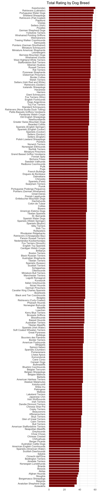<!-- -->

  18. The final product of this exercise will be a graph with the top-20 dogs in total ratings (from previous problem) on the y-axis, year on the x-axis, and points colored by each breed's ranking for that year (from the `breed_rank_all` dataset). The points within each breed will be connected by a line, and the breeds should be arranged from the highest median rank to lowest median rank ("highest" is actually the smallest number, eg. 1 = best). After you're finished, think of AT LEAST one thing you could you do to make this graph better. HINTS: 1. Start with the `breed_rank_all` dataset and pivot it so year is a variable. 2. Use the `separate()` function to get year alone, and there's an extra argument in that function that can make it numeric. 3. For both datasets used, you'll need to `str_squish()` Breed before joining. 
  

```r
special_breeds <- breed_rank_all %>%
  pivot_longer(cols = `2013 Rank`:`2020 Rank`,
              names_to = "Year",
              values_to = "Rank" ) %>% 
  separate(Year, 
           into = "Year",
           extra = 'drop',
           convert = TRUE) %>% 
  inner_join(breed_traits_total %>% mutate(Breed = str_squish(Breed)) %>% arrange(total_rating) %>% top_n(20), 
            by = 'Breed')
  
breed_traits_total %>% mutate(Breed = str_squish(Breed)) %>% arrange(total_rating) %>% top_n(20)
```

<div data-pagedtable="false">
  <script data-pagedtable-source type="application/json">
{"columns":[{"label":["Breed"],"name":[1],"type":["chr"],"align":["left"]},{"label":["total_rating"],"name":[2],"type":["dbl"],"align":["right"]}],"data":[{"1":"Pointers (German Shorthaired)","2":"55"},{"1":"Yorkshire Terriers","2":"55"},{"1":"Miniature Schnauzers","2":"55"},{"1":"Bernese Mountain Dogs","2":"55"},{"1":"Miniature American Shepherds","2":"55"},{"1":"Weimaraners","2":"55"},{"1":"Samoyeds","2":"55"},{"1":"Wirehaired Pointing Griffons","2":"55"},{"1":"Leonbergers","2":"55"},{"1":"Treeing Walker Coonhounds","2":"55"},{"1":"German Shepherd Dogs","2":"56"},{"1":"Poodles","2":"56"},{"1":"Vizslas","2":"56"},{"1":"Setters (Irish)","2":"56"},{"1":"Shetland Sheepdogs","2":"57"},{"1":"Papillons","2":"57"},{"1":"Retrievers (Flat-Coated)","2":"57"},{"1":"Retrievers (Labrador)","2":"58"},{"1":"Portuguese Water Dogs","2":"58"},{"1":"Keeshonden","2":"60"}],"options":{"columns":{"min":{},"max":[10]},"rows":{"min":[10],"max":[10]},"pages":{}}}
  </script>
</div>

```r
special_breeds %>% 
 ggplot(aes(y = fct_reorder(Breed, total_rating), x = Year, color = Rank)) +
  geom_point() +
  geom_line(aes(group =Breed)) +
  labs(title = 'Top 20 Dog Breeds Ranked Across Time', x = "", y ="" ) +
  scale_color_continuous(low = "maroon4", high = "white")
```

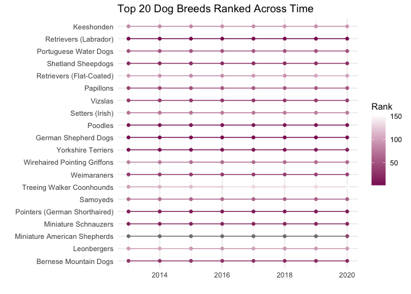<!-- -->

The lines connecting each point do not mean much. I would do the top 10 and have color be Breed, and put rank on the y to see how rank varied over time x for each breed. 

  19. Create your own! Requirements: use a `join` or `pivot` function (or both, if you'd like), a `str_XXX()` function, and a `fct_XXX()` function to create a graph using any of the dog datasets. One suggestion is to try to improve the graph you created for the Tidy Tuesday assignment. If you want an extra challenge, find a way to use the dog images in the `breed_rank_all` file - check out the `ggimage` library and [this resource](https://wilkelab.org/ggtext/) for putting images as labels.
  

```r
breed_rank_all %>%
  pivot_longer(cols = `2013 Rank`:`2020 Rank`,
              names_to = "Year",
              values_to = "Rank" ) %>% 
  separate(Year, 
           into = "Year",
           extra = 'drop',
           convert = TRUE) %>% 
  inner_join(breed_traits %>% 
               filter(`Drooling Level` == '5') %>% 
               mutate(Breed = str_squish(Breed)),
                       by = 'Breed') %>% 
  ggplot(aes(color = fct_rev(fct_reorder(Breed, Rank)), x = Year, y = Rank))+
  geom_point() +
  geom_line(aes(group = Breed)) +
  labs(title = "Ranks Across Time of Dog Breeds that Drool the Most", x = "", y ="", color = 'Breed')
```

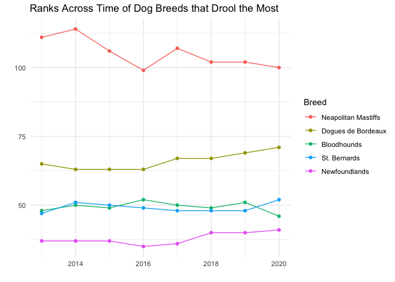<!-- -->
  
Here we see that out of the 5 dogs that got a 5 score on 'Drooling Level', Newfoundlands are the most highly ranked and are the best while Neapolitan Mastiffs are the lowest ranked. 

## GitHub link

  20. Below, provide a link to your GitHub page with this set of Weekly Exercises. Specifically, if the name of the file is 03_exercises.Rmd, provide a link to the 03_exercises.md file, which is the one that will be most readable on GitHub.
  
[Repository](https://github.com/csswilson/ds_exercise_3.git)  
[03_exercises.Rmd Git Link](https://github.com/csswilson/ds_exercise_3/blob/506723c9685447c752ffb9a1301a117d67d00593/03_exercises.Rmd)

## Challenge problem! 

This problem uses the data from the Tidy Tuesday competition this week, `kids`. If you need to refresh your memory on the data, read about it [here](https://github.com/rfordatascience/tidytuesday/blob/master/data/2020/2020-09-15/readme.md). 

  21. In this exercise, you are going to try to replicate the graph below, created by Georgios Karamanis. I'm sure you can find the exact code on GitHub somewhere, but **DON'T DO THAT!** You will only be graded for putting an effort into this problem. So, give it a try and see how far you can get without doing too much googling. HINT: use `facet_geo()`. The graphic won't load below since it came from a location on my computer. So, you'll have to reference the original html on the moodle page to see it.
  

**DID YOU REMEMBER TO UNCOMMENT THE OPTIONS AT THE TOP?**
